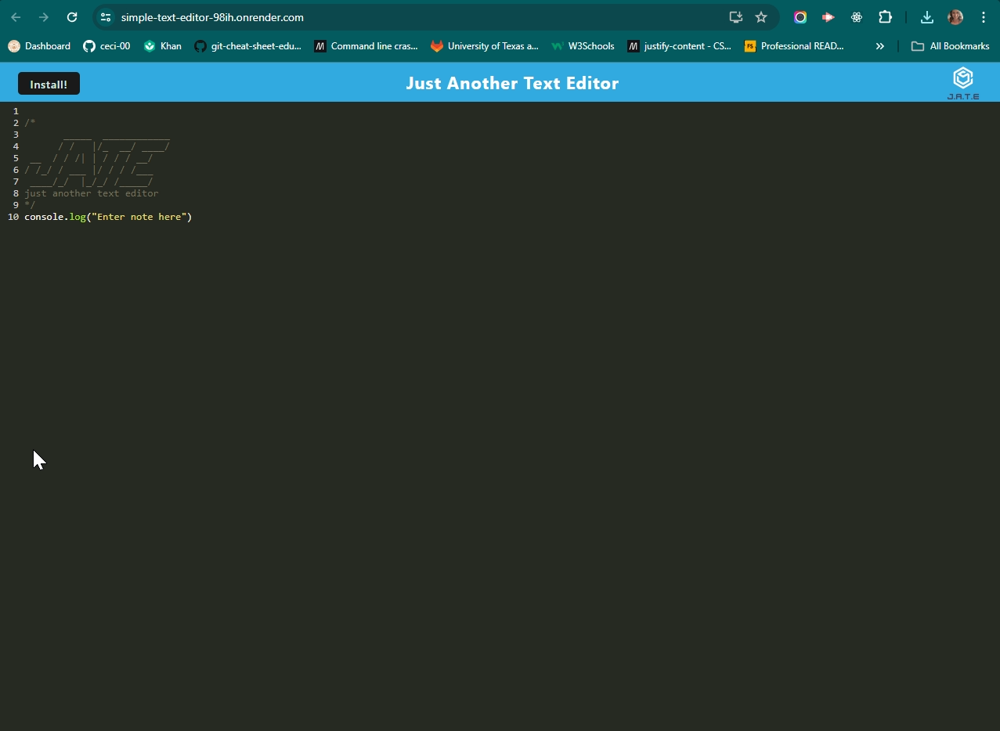
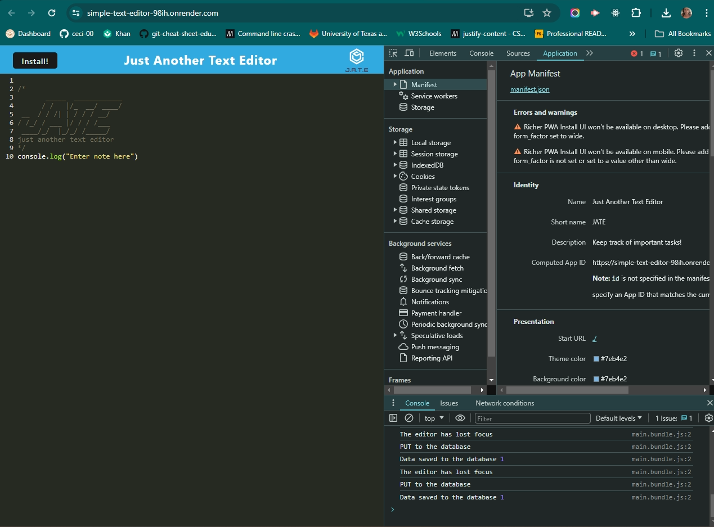
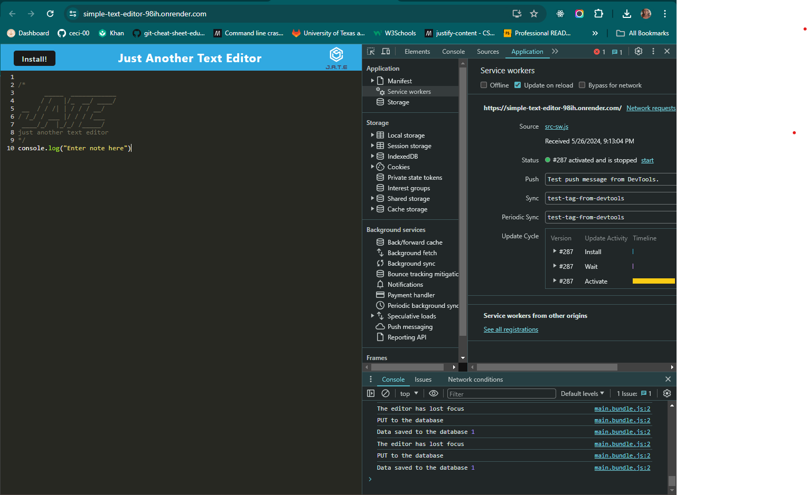
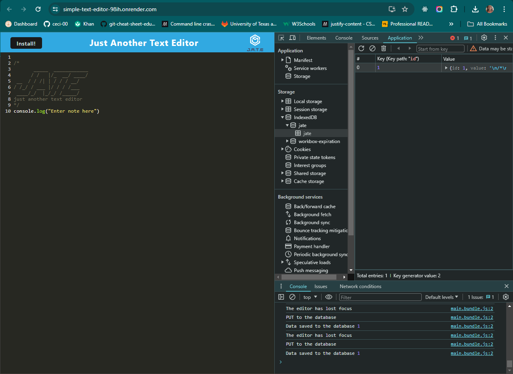
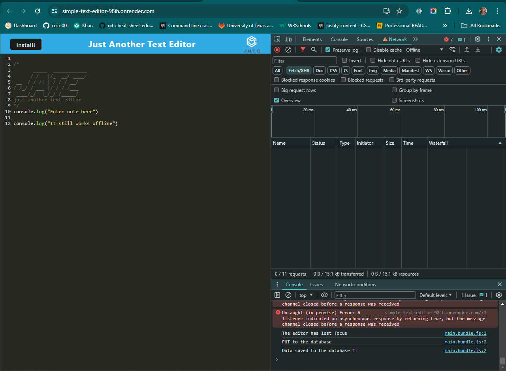
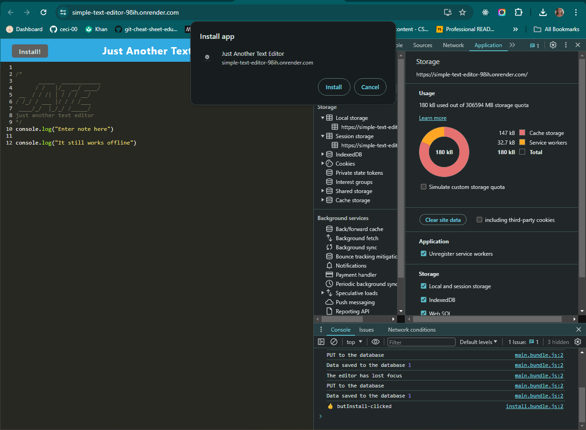

# JATE - Simple Text Editor

## Description
This is a text editor application that runs in the browser and meets the Progressive Web Application (PWA) criteria. It features data persistence techniques and can function offline.

## Features

- Single-page application built with Webpack
- Data persistence using IndexedDB
- Offline functionality
- Installable as a desktop application

## Table of Contents
* [Description](#description)
* [Features](#features)
* [Installation](#installation)
* [Usage](#usage)
* [Deployment](#deployment)
* [Technologies](#technologies)
* [License](#license)
* [Credits](#credits)

## Installation

1. Clone the repository
2. Navigate to the project directory
3. run `npm install` to install dependencies
4. run `npm run build` to build webpack

## Usage
1. Run `npm run start:dev` to start the application
2. Open the text editor in your browser on localhost:3000
3. Enter text and it will be automatically saved to IndexedDB
4. Text remains saved even after clicking outside of the active window and/or downloading the application to be used offline

## Deployment

This application is deployed to Render using the provided build scripts for a Webpack application.
[JATE Render Link](https://simple-text-editor-98ih.onrender.com)

## Technologies

- JavaScript
- Webpack
- IndexedDB
- Service Workers
- Workbox

## License
[License: MIT](https://opensource.org/licenses/MIT)

## Credits

UTA-VIRT-FSF-PT-12-2023-U-LOLC/19-PWA/Activities

## Contact
Github Repo - https://github.com/ceci-00/Simple-Text-Editor.git

Email - ceci.ga003@gmail.com